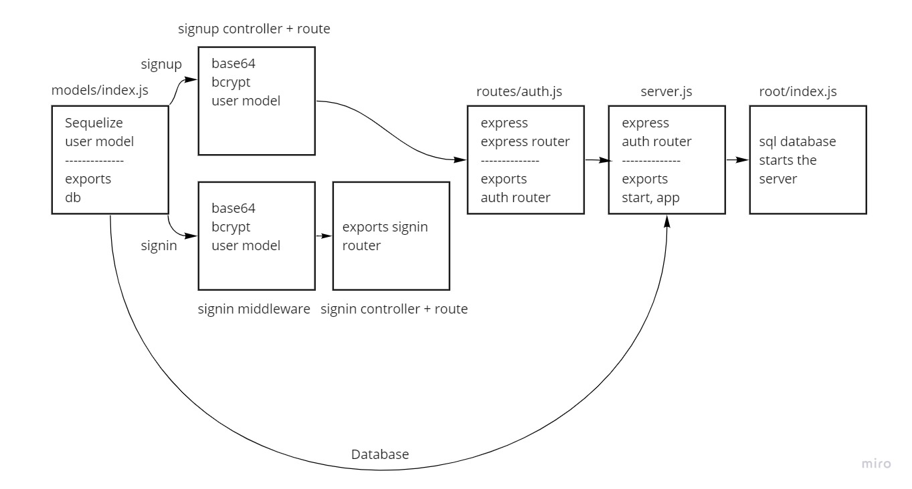

# basic-auth

Creating an Express server that implements Basic Authentication, with signup and signin capabilities, using a Postgres database for storage.

## Submission

1. [PR Link](https://github.com/karamalqinneh/basic-auth/pull/4)
2. [Server Deployment](https://karam-basic-auth.herokuapp.com/)

## UML Diagram

